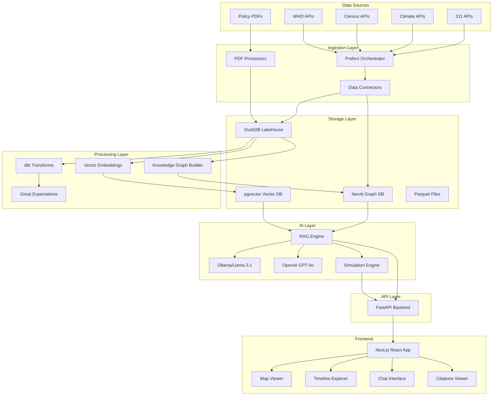

# Glonav - Global Policy & Knowledge Navigator

A production-grade web application that ingests diverse public datasets (311 data, climate, census, WHO, EU/US policy PDFs), builds a unified knowledge graph + warehouse, and allows users to ask natural language questions with grounded answers and citations.

## 🚀 Quick Start

### Prerequisites
- Docker & Docker Compose
- Node.js 18+ (for frontend development)
- Python 3.10+ (for backend development)

### 1. Clone and Setup
```bash
git clone <repository-url>
cd glonav
cp .env.example .env
# Edit .env with your configuration
```

### 2. Start Services
```bash
# Start all services
docker-compose up -d

# Or start development mode
make dev
```

### 3. Access the Application
- **Frontend**: http://localhost:3000
- **Backend API**: http://localhost:8000
- **API Docs**: http://localhost:8000/docs
- **Neo4j Browser**: http://localhost:7474 (neo4j/password)
- **Prefect UI**: http://localhost:4200

## 🏗️ Architecture



## 📁 Project Structure

```
glonav/
├── backend/                 # FastAPI backend
│   ├── app/
│   │   ├── api/            # API endpoints
│   │   ├── core/           # Core functionality
│   │   ├── models/         # Data models
│   │   ├── services/       # Business logic
│   │   └── utils/          # Utilities
│   ├── tests/
│   └── requirements.txt
├── frontend/               # Next.js frontend
│   ├── components/
│   ├── pages/
│   ├── lib/
│   ├── public/
│   └── package.json
├── orchestration/          # Prefect workflows
│   ├── flows/
│   ├── tasks/
│   └── deployments/
├── transforms/             # dbt transforms
│   ├── models/
│   ├── macros/
│   └── dbt_project.yml
├── data/                   # Data storage
│   ├── raw/
│   ├── processed/
│   └── warehouse/
├── docker/                 # Docker configurations
├── k8s/                   # Kubernetes manifests
├── .github/               # GitHub Actions
└── docs/                  # Documentation
```

## 🔧 Development

### Backend Development
```bash
cd backend
python -m venv venv
source venv/bin/activate  # or `venv\Scripts\activate` on Windows
pip install -r requirements.txt
uvicorn app.main:app --reload --host 0.0.0.0 --port 8000
```

### Frontend Development
```bash
cd frontend
npm install
npm run dev
```

### Running Tests
```bash
# Backend tests
cd backend && python -m pytest

# Frontend tests
cd frontend && npm test
```

## 📊 Example Queries

### Analyst Mode
**Query**: "What's the correlation between air quality violations and respiratory disease rates in urban areas?"

**Response**: Provides statistical analysis with data visualizations, correlation coefficients, and trend analysis with proper citations to EPA and CDC datasets.

### Researcher Mode
**Query**: "How do EU climate policies compare to US federal regulations on carbon emissions?"

**Response**: Detailed policy comparison with references to specific legislation, implementation timelines, and effectiveness metrics.

### Citizen Mode
**Query**: "Why are there so many potholes in my neighborhood and when will they be fixed?"

**Response**: Simple explanation using 311 data, work order status, and budget information in accessible language.

## 🌐 API Endpoints

- `POST /api/ask` - Natural language query with context and citations
- `POST /api/simulate` - Forecasting and projection mode
- `GET /api/graph/query` - Direct graph database queries
- `GET /api/datasets` - Available dataset metadata
- `GET /api/health` - Health check

## 🚀 Deployment

### Local Development
```bash
docker-compose up -d
```

### Production (Kubernetes)
```bash
kubectl apply -f k8s/
```

### CI/CD
GitHub Actions automatically:
- Runs tests on PR
- Builds and pushes Docker images
- Deploys to staging/production

## 📈 Monitoring

- Application metrics via Prometheus
- Logs aggregation via ELK stack
- Error tracking via Sentry
- Performance monitoring via APM

## 🤝 Contributing

1. Fork the repository
2. Create a feature branch
3. Make your changes
4. Add tests
5. Submit a pull request

## 📄 License

This project is licensed under the MIT License - see the LICENSE file for details.