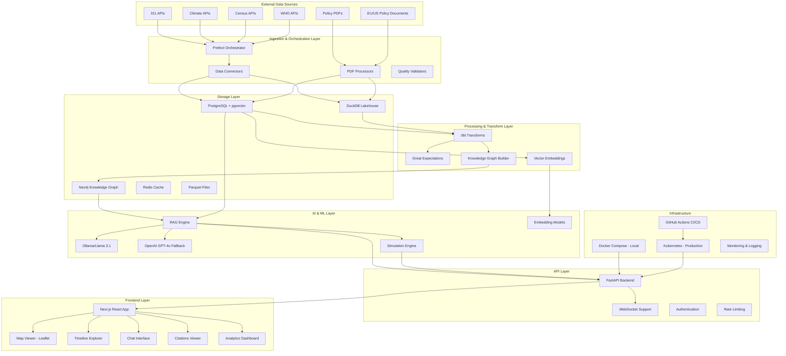

# Glonav Architecture Documentation

## System Overview

Glonav (Global Policy & Knowledge Navigator) is a production-grade web application that ingests diverse public datasets, builds a unified knowledge graph and data warehouse, and allows users to ask natural language questions with grounded, cited answers.

## Architecture Diagram



## Component Architecture

### 1. Data Ingestion Layer

#### Prefect Orchestration
- **Purpose**: Orchestrates all ETL workflows and data pipelines
- **Components**:
  - Flow definitions for each data source
  - Task scheduling and dependency management
  - Error handling and retry logic
  - Data quality monitoring

#### Data Connectors
- **NYC 311 Connector**: Fetches service requests from NYC Open Data API
- **EPA Air Quality Connector**: Retrieves air quality measurements
- **Census Data Connector**: Pulls demographic and population data
- **WHO Health Connector**: Fetches global health indicators
- **Climate Data Connector**: Retrieves climate and weather data
- **PDF Processor**: Extracts text and metadata from policy documents

### 2. Storage Layer

#### PostgreSQL + pgvector
- **Primary Database**: Stores structured data, metadata, and user information
- **Vector Search**: Enables semantic search with pgvector extension
- **ACID Compliance**: Ensures data consistency and reliability

#### DuckDB Lakehouse
- **Analytics Database**: Optimized for analytical queries
- **Columnar Storage**: Efficient compression and query performance
- **Parquet Integration**: Seamless integration with data lake storage

#### Neo4j Knowledge Graph
- **Graph Database**: Stores entities and relationships
- **Cypher Queries**: Enables complex graph traversals
- **APOC Extensions**: Advanced graph algorithms and procedures

#### Redis Cache
- **Session Management**: Stores user sessions and conversation history
- **Query Caching**: Caches frequently accessed data
- **Real-time Data**: Supports WebSocket connections

### 3. AI & ML Layer

#### LLM Integration
- **Primary**: Ollama with Llama 3.1 8B (local inference)
- **Fallback**: OpenAI GPT-4o and Google Gemini
- **Load Balancing**: Automatic failover between providers

#### RAG (Retrieval-Augmented Generation)
- **Hybrid Retrieval**: Combines vector, keyword, and graph search
- **Context Assembly**: Builds relevant context from multiple sources
- **Citation Generation**: Tracks and provides source citations

#### Answer Modes
- **Analyst Mode**: Data-driven insights with statistical analysis
- **Researcher Mode**: Comprehensive analysis with multiple perspectives
- **Citizen Mode**: Simple, accessible explanations

### 4. API Layer

#### FastAPI Backend
- **RESTful APIs**: Standard HTTP endpoints for all operations
- **WebSocket Support**: Real-time chat and streaming responses
- **Authentication**: JWT-based authentication with role-based access
- **Rate Limiting**: Protects against abuse and ensures fair usage
- **API Documentation**: Auto-generated OpenAPI/Swagger documentation

#### Key Endpoints
- `POST /api/v1/chat/ask` - Natural language queries
- `POST /api/v1/chat/simulate` - Scenario forecasting
- `GET /api/v1/datasets` - Dataset metadata and exploration
- `GET /api/v1/graph/query` - Knowledge graph queries
- `GET /api/v1/health` - System health monitoring

### 5. Frontend Layer

#### Next.js Application
- **Server-Side Rendering**: Improved SEO and performance
- **Progressive Web App**: Offline capabilities and mobile optimization
- **Real-time Updates**: WebSocket integration for live responses

#### Key Components
- **Chat Interface**: Natural language query interface with multiple modes
- **Map Viewer**: Geographic visualization of datasets using Leaflet
- **Timeline Explorer**: Temporal data exploration and trend analysis
- **Citations Viewer**: Source verification and citation management
- **Analytics Dashboard**: System metrics and usage analytics

### 6. Infrastructure Layer

#### Development Environment
- **Docker Compose**: Local development with all services
- **Hot Reloading**: Rapid development feedback
- **Database Seeding**: Sample data for development

#### Production Environment
- **Kubernetes**: Container orchestration and scaling
- **Ingress Controllers**: Load balancing and SSL termination
- **Persistent Volumes**: Data persistence across pod restarts
- **Auto-scaling**: Horizontal pod autoscaling based on metrics

#### CI/CD Pipeline
- **GitHub Actions**: Automated testing and deployment
- **Multi-stage Builds**: Optimized container images
- **Security Scanning**: Vulnerability assessment
- **Blue-Green Deployment**: Zero-downtime deployments

## Data Flow

### 1. Ingestion Flow
```
External APIs → Prefect Flows → Data Validation → Storage (PostgreSQL/DuckDB)
Policy PDFs → PDF Processing → Text Extraction → Vector Embeddings → Storage
```

### 2. Knowledge Graph Construction
```
Raw Data → Entity Extraction → Relationship Mapping → Neo4j Storage → Graph Validation
```

### 3. Query Processing Flow
```
User Query → Intent Classification → RAG Retrieval → Context Assembly → LLM Generation → Response + Citations
```

### 4. Simulation Flow
```
Scenario Input → Historical Data Retrieval → Statistical Modeling → LLM Narrative → Projection Visualization
```

## Scalability Considerations

### Horizontal Scaling
- **Backend Services**: Multiple API server instances behind load balancer
- **Database Read Replicas**: Distribute read queries across replicas
- **Cache Clustering**: Redis cluster for high availability
- **Queue Processing**: Distributed task processing with Prefect

### Performance Optimization
- **Database Indexing**: Optimized indexes for common query patterns
- **Query Caching**: Multi-layer caching strategy
- **CDN Integration**: Static asset delivery optimization
- **Connection Pooling**: Efficient database connection management

### Monitoring & Observability
- **Metrics Collection**: Prometheus for system and application metrics
- **Logging**: Structured logging with ELK stack
- **Tracing**: Distributed tracing for request flows
- **Alerting**: Real-time alerts for system issues

## Security Architecture

### Authentication & Authorization
- **JWT Tokens**: Stateless authentication
- **Role-Based Access**: Fine-grained permission system
- **API Key Management**: External API credential management

### Data Protection
- **Encryption at Rest**: Database and file encryption
- **Encryption in Transit**: TLS for all communications
- **Data Anonymization**: PII protection in datasets
- **Audit Logging**: Complete audit trail for data access

### Network Security
- **Network Policies**: Kubernetes network segmentation
- **Firewall Rules**: Traffic filtering and monitoring
- **DDoS Protection**: Rate limiting and traffic shaping
- **Vulnerability Scanning**: Regular security assessments

## Deployment Architecture

### Environment Strategy
- **Development**: Local Docker Compose setup
- **Staging**: Kubernetes cluster with reduced resources
- **Production**: Full Kubernetes deployment with HA

### Blue-Green Deployment
- **Zero Downtime**: Seamless updates without service interruption
- **Rollback Capability**: Quick rollback to previous version
- **Health Checks**: Automated health verification before traffic switch

### Disaster Recovery
- **Database Backups**: Regular automated backups
- **Cross-Region Replication**: Geographic redundancy
- **Recovery Testing**: Regular disaster recovery drills
- **Documentation**: Detailed recovery procedures

## Technology Stack Summary

| Layer | Technology | Purpose |
|-------|------------|---------|
| Frontend | Next.js, React, TypeScript | User interface and experience |
| API | FastAPI, Python | Backend services and APIs |
| Databases | PostgreSQL, DuckDB, Neo4j | Data storage and retrieval |
| Cache | Redis | Session and query caching |
| AI/ML | Ollama, OpenAI, Sentence Transformers | Language models and embeddings |
| Orchestration | Prefect | Workflow management |
| Quality | Great Expectations | Data quality assurance |
| Transforms | dbt | Data transformation |
| Containerization | Docker, Kubernetes | Deployment and scaling |
| CI/CD | GitHub Actions | Automated testing and deployment |
| Monitoring | Prometheus, Grafana | System monitoring |
| Logging | ELK Stack | Centralized logging |

This architecture provides a robust, scalable, and maintainable foundation for the Glonav application while ensuring high availability, security, and performance.